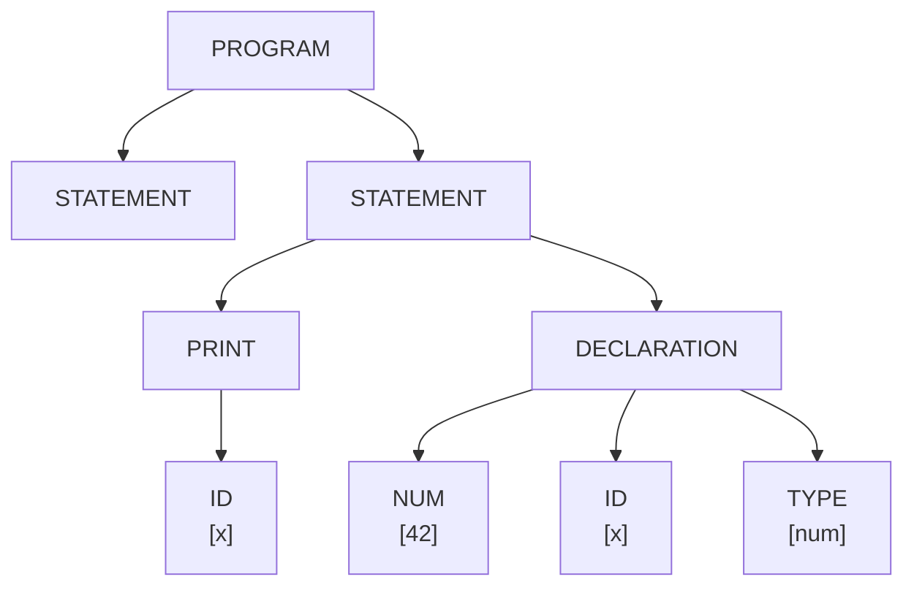
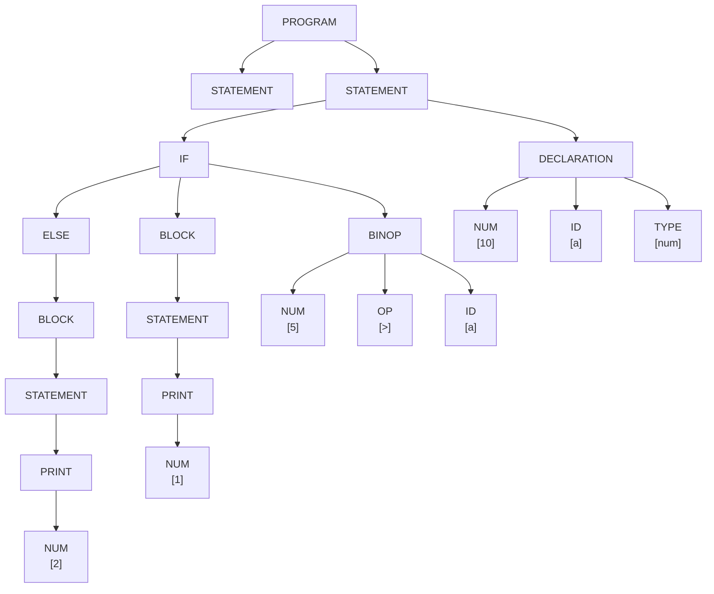
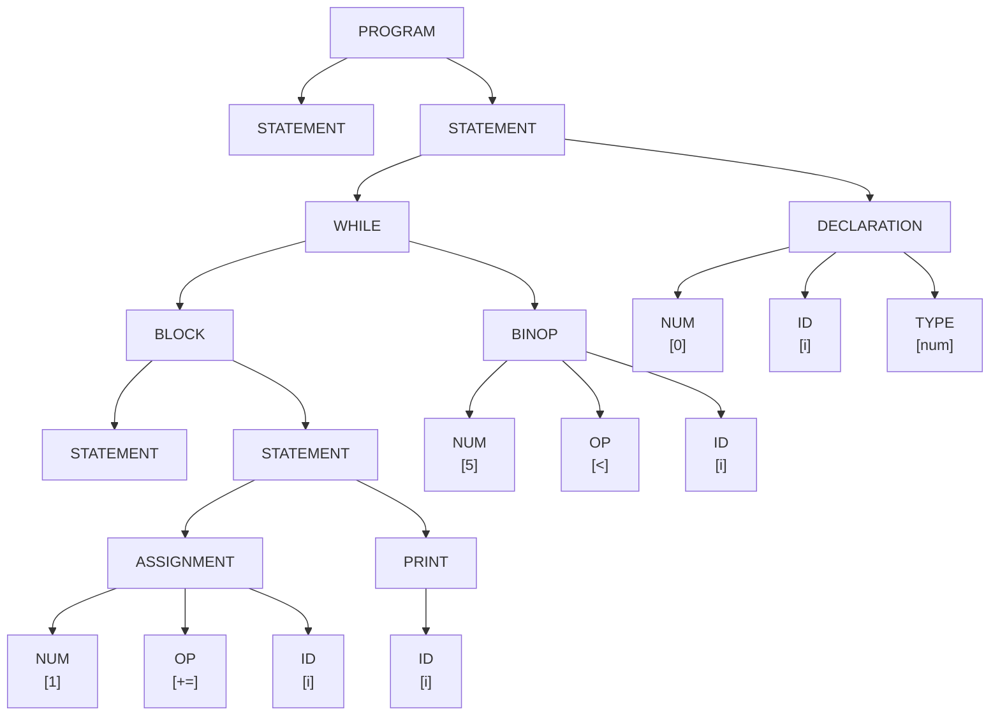
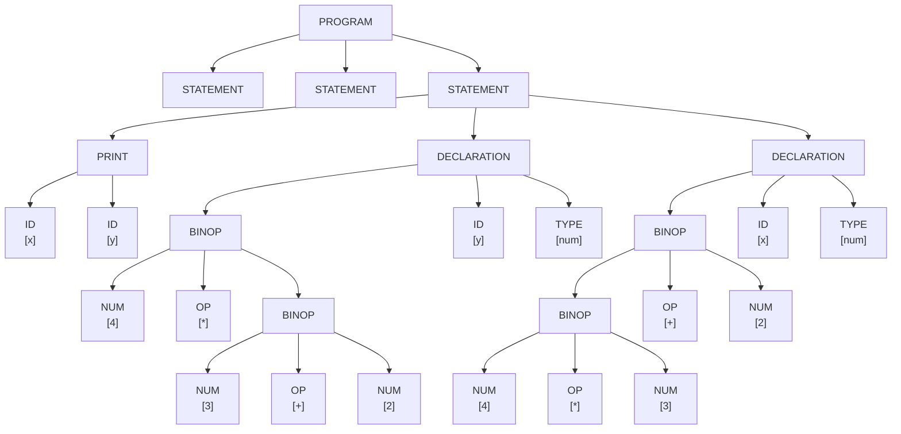
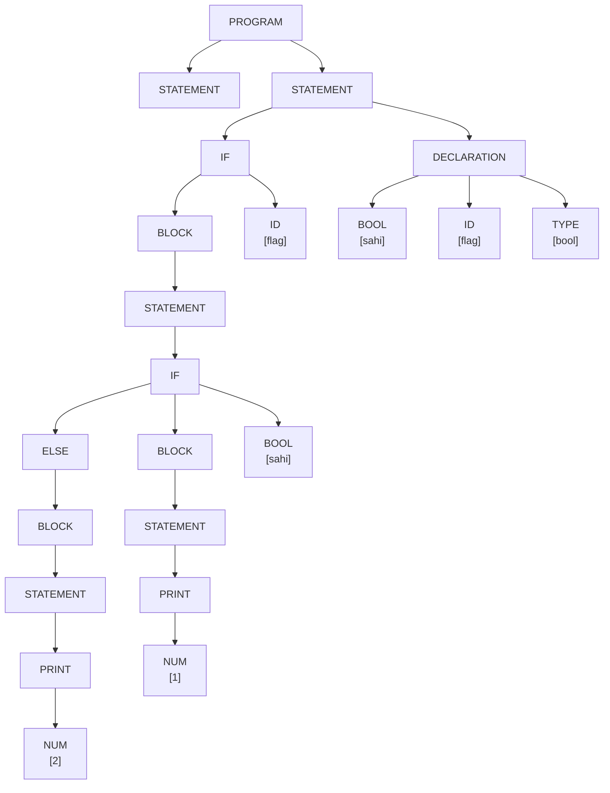
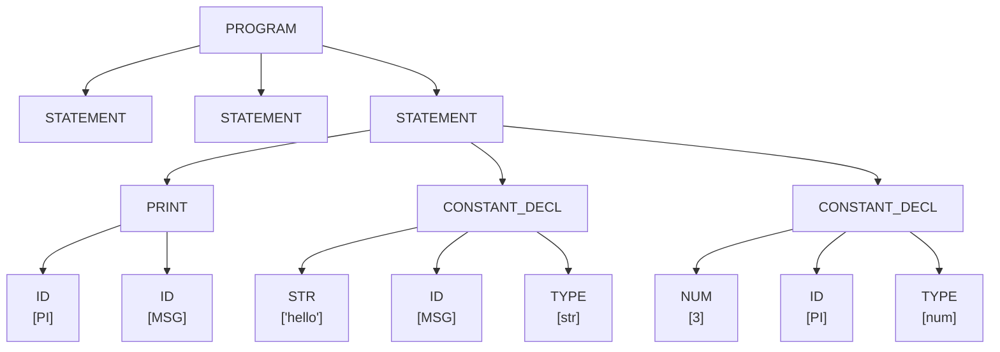

# Part 3 - Reverse Derivation Trees (Improved Representation)

Generated on: 2026-04-01 17:36:04

Graph images: PNG files are available in part3_graphs/.

## Testcase: testcases/valid/test1_basic.bro

### Tree View (Post-Order)

```text
      └─ TYPE [num]
      └─ ID [x]
      └─ NUM [42]
    └─ DECLARATION
      └─ ID [x]
    └─ PRINT
  └─ STATEMENT
  └─ STATEMENT
└─ PROGRAM
```

### Graph View (Mermaid)



### Exported Graph Files

- DOT: part3_graphs/testcases_valid_test1_basic.bro.dot
- PNG: part3_graphs/testcases_valid_test1_basic.bro.png

### Structured Reduction Trace

| Step | Depth | Symbol | Value |
|---:|---:|---|---|
| 1 | 3 | TYPE | num |
| 2 | 3 | ID | x |
| 3 | 3 | NUM | 42 |
| 4 | 2 | DECLARATION | - |
| 5 | 3 | ID | x |
| 6 | 2 | PRINT | - |
| 7 | 1 | STATEMENT | - |
| 8 | 1 | STATEMENT | - |
| 9 | 0 | PROGRAM | - |

## Testcase: testcases/valid/test2_if_else.bro

### Tree View (Post-Order)

```text
      └─ TYPE [num]
      └─ ID [a]
      └─ NUM [10]
    └─ DECLARATION
        └─ ID [a]
        └─ OP [>]
        └─ NUM [5]
      └─ BINOP
            └─ NUM [1]
          └─ PRINT
        └─ STATEMENT
      └─ BLOCK
              └─ NUM [2]
            └─ PRINT
          └─ STATEMENT
        └─ BLOCK
      └─ ELSE
    └─ IF
  └─ STATEMENT
  └─ STATEMENT
└─ PROGRAM
```

### Graph View (Mermaid)



### Exported Graph Files

- DOT: part3_graphs/testcases_valid_test2_if_else.bro.dot
- PNG: part3_graphs/testcases_valid_test2_if_else.bro.png

### Structured Reduction Trace

| Step | Depth | Symbol | Value |
|---:|---:|---|---|
| 1 | 3 | TYPE | num |
| 2 | 3 | ID | a |
| 3 | 3 | NUM | 10 |
| 4 | 2 | DECLARATION | - |
| 5 | 4 | ID | a |
| 6 | 4 | OP | > |
| 7 | 4 | NUM | 5 |
| 8 | 3 | BINOP | - |
| 9 | 6 | NUM | 1 |
| 10 | 5 | PRINT | - |
| 11 | 4 | STATEMENT | - |
| 12 | 3 | BLOCK | - |
| 13 | 7 | NUM | 2 |
| 14 | 6 | PRINT | - |
| 15 | 5 | STATEMENT | - |
| 16 | 4 | BLOCK | - |
| 17 | 3 | ELSE | - |
| 18 | 2 | IF | - |
| 19 | 1 | STATEMENT | - |
| 20 | 1 | STATEMENT | - |
| 21 | 0 | PROGRAM | - |

## Testcase: testcases/valid/test3_loop.bro

### Tree View (Post-Order)

```text
      └─ TYPE [num]
      └─ ID [i]
      └─ NUM [0]
    └─ DECLARATION
        └─ ID [i]
        └─ OP [<]
        └─ NUM [5]
      └─ BINOP
            └─ ID [i]
          └─ PRINT
            └─ ID [i]
            └─ OP [+=]
            └─ NUM [1]
          └─ ASSIGNMENT
        └─ STATEMENT
        └─ STATEMENT
      └─ BLOCK
    └─ WHILE
  └─ STATEMENT
  └─ STATEMENT
└─ PROGRAM
```

### Graph View (Mermaid)



### Exported Graph Files

- DOT: part3_graphs/testcases_valid_test3_loop.bro.dot
- PNG: part3_graphs/testcases_valid_test3_loop.bro.png

### Structured Reduction Trace

| Step | Depth | Symbol | Value |
|---:|---:|---|---|
| 1 | 3 | TYPE | num |
| 2 | 3 | ID | i |
| 3 | 3 | NUM | 0 |
| 4 | 2 | DECLARATION | - |
| 5 | 4 | ID | i |
| 6 | 4 | OP | < |
| 7 | 4 | NUM | 5 |
| 8 | 3 | BINOP | - |
| 9 | 6 | ID | i |
| 10 | 5 | PRINT | - |
| 11 | 6 | ID | i |
| 12 | 6 | OP | += |
| 13 | 6 | NUM | 1 |
| 14 | 5 | ASSIGNMENT | - |
| 15 | 4 | STATEMENT | - |
| 16 | 4 | STATEMENT | - |
| 17 | 3 | BLOCK | - |
| 18 | 2 | WHILE | - |
| 19 | 1 | STATEMENT | - |
| 20 | 1 | STATEMENT | - |
| 21 | 0 | PROGRAM | - |

## Testcase: testcases/valid/test4_arithmetic.bro

### Tree View (Post-Order)

```text
      └─ TYPE [num]
      └─ ID [x]
        └─ NUM [2]
        └─ OP [+]
          └─ NUM [3]
          └─ OP [*]
          └─ NUM [4]
        └─ BINOP
      └─ BINOP
    └─ DECLARATION
      └─ TYPE [num]
      └─ ID [y]
          └─ NUM [2]
          └─ OP [+]
          └─ NUM [3]
        └─ BINOP
        └─ OP [*]
        └─ NUM [4]
      └─ BINOP
    └─ DECLARATION
      └─ ID [y]
      └─ ID [x]
    └─ PRINT
  └─ STATEMENT
  └─ STATEMENT
  └─ STATEMENT
└─ PROGRAM
```

### Graph View (Mermaid)



### Exported Graph Files

- DOT: part3_graphs/testcases_valid_test4_arithmetic.bro.dot
- PNG: part3_graphs/testcases_valid_test4_arithmetic.bro.png

### Structured Reduction Trace

| Step | Depth | Symbol | Value |
|---:|---:|---|---|
| 1 | 3 | TYPE | num |
| 2 | 3 | ID | x |
| 3 | 4 | NUM | 2 |
| 4 | 4 | OP | + |
| 5 | 5 | NUM | 3 |
| 6 | 5 | OP | * |
| 7 | 5 | NUM | 4 |
| 8 | 4 | BINOP | - |
| 9 | 3 | BINOP | - |
| 10 | 2 | DECLARATION | - |
| 11 | 3 | TYPE | num |
| 12 | 3 | ID | y |
| 13 | 5 | NUM | 2 |
| 14 | 5 | OP | + |
| 15 | 5 | NUM | 3 |
| 16 | 4 | BINOP | - |
| 17 | 4 | OP | * |
| 18 | 4 | NUM | 4 |
| 19 | 3 | BINOP | - |
| 20 | 2 | DECLARATION | - |
| 21 | 3 | ID | y |
| 22 | 3 | ID | x |
| 23 | 2 | PRINT | - |
| 24 | 1 | STATEMENT | - |
| 25 | 1 | STATEMENT | - |
| 26 | 1 | STATEMENT | - |
| 27 | 0 | PROGRAM | - |

## Testcase: testcases/valid/test5_nested_if.bro

### Tree View (Post-Order)

```text
      └─ TYPE [bool]
      └─ ID [flag]
      └─ BOOL [sahi]
    └─ DECLARATION
      └─ ID [flag]
            └─ BOOL [sahi]
                  └─ NUM [1]
                └─ PRINT
              └─ STATEMENT
            └─ BLOCK
                    └─ NUM [2]
                  └─ PRINT
                └─ STATEMENT
              └─ BLOCK
            └─ ELSE
          └─ IF
        └─ STATEMENT
      └─ BLOCK
    └─ IF
  └─ STATEMENT
  └─ STATEMENT
└─ PROGRAM
```

### Graph View (Mermaid)



### Exported Graph Files

- DOT: part3_graphs/testcases_valid_test5_nested_if.bro.dot
- PNG: part3_graphs/testcases_valid_test5_nested_if.bro.png

### Structured Reduction Trace

| Step | Depth | Symbol | Value |
|---:|---:|---|---|
| 1 | 3 | TYPE | bool |
| 2 | 3 | ID | flag |
| 3 | 3 | BOOL | sahi |
| 4 | 2 | DECLARATION | - |
| 5 | 3 | ID | flag |
| 6 | 6 | BOOL | sahi |
| 7 | 9 | NUM | 1 |
| 8 | 8 | PRINT | - |
| 9 | 7 | STATEMENT | - |
| 10 | 6 | BLOCK | - |
| 11 | 10 | NUM | 2 |
| 12 | 9 | PRINT | - |
| 13 | 8 | STATEMENT | - |
| 14 | 7 | BLOCK | - |
| 15 | 6 | ELSE | - |
| 16 | 5 | IF | - |
| 17 | 4 | STATEMENT | - |
| 18 | 3 | BLOCK | - |
| 19 | 2 | IF | - |
| 20 | 1 | STATEMENT | - |
| 21 | 1 | STATEMENT | - |
| 22 | 0 | PROGRAM | - |

## Testcase: testcases/valid/test6_constants.bro

### Tree View (Post-Order)

```text
      └─ TYPE [num]
      └─ ID [PI]
      └─ NUM [3]
    └─ CONSTANT_DECL
      └─ TYPE [str]
      └─ ID [MSG]
      └─ STR ["hello"]
    └─ CONSTANT_DECL
      └─ ID [MSG]
      └─ ID [PI]
    └─ PRINT
  └─ STATEMENT
  └─ STATEMENT
  └─ STATEMENT
└─ PROGRAM
```

### Graph View (Mermaid)



### Exported Graph Files

- DOT: part3_graphs/testcases_valid_test6_constants.bro.dot
- PNG: part3_graphs/testcases_valid_test6_constants.bro.png

### Structured Reduction Trace

| Step | Depth | Symbol | Value |
|---:|---:|---|---|
| 1 | 3 | TYPE | num |
| 2 | 3 | ID | PI |
| 3 | 3 | NUM | 3 |
| 4 | 2 | CONSTANT_DECL | - |
| 5 | 3 | TYPE | str |
| 6 | 3 | ID | MSG |
| 7 | 3 | STR | "hello" |
| 8 | 2 | CONSTANT_DECL | - |
| 9 | 3 | ID | MSG |
| 10 | 3 | ID | PI |
| 11 | 2 | PRINT | - |
| 12 | 1 | STATEMENT | - |
| 13 | 1 | STATEMENT | - |
| 14 | 1 | STATEMENT | - |
| 15 | 0 | PROGRAM | - |

